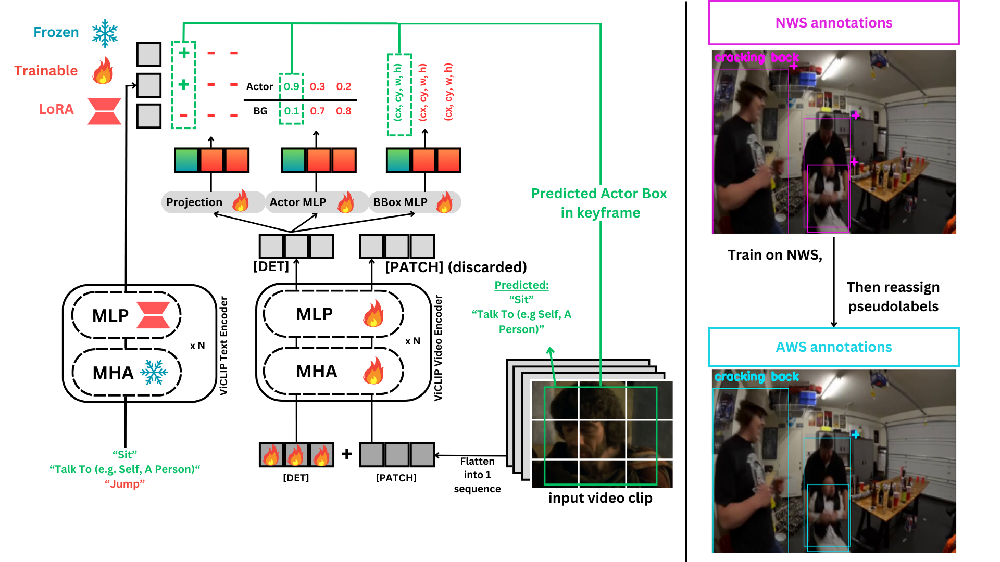

# Official PyTorch Implementation of SiA

Official PyTorch implementation of the **[SiA: A *Si*mple *A*rchitecture for Open Vocabulary Action Detection]()**. If you use this code for your research, please cite our paper.

## To-do
- [ ] Efficiency (e.g. FP16)
- [ ] HuggingFace

> **EZACT: Efficient Open Vocabulary Action Detection**<br>
> Z.H Sia and Y.S Rawat<br>
> <br>
> 
>
> **Abstract**: 

<p alighn="center">
In this work, we focus on open-vocabulary action detection. Existing approaches for action detection are predominantly limited to closed-set scenarios and rely on complex, multi-stage architectures. Extending these models to open-vocabulary settings poses two key challenges: (1) the difficulty of training due to architectural complexity and multi-stage processes, and (2) the lack of large-scale datasets with diverse action classes for robust training. We propose SiA, a simple encoder-based architecture for action detection that uses trainable detection tokens within the encoder to perform detection, eliminating the need for a decoder. SiA is a single-stage model which is trained end-to-end leveraging a multimodal approach adapted from vision-language models, allowing it to perform open-vocabulary action detection effectively. Additionally, we introduce a simple weakly supervised training strategy for action detection that enables SiA to be trained on datasets with only partial detection annotations, facilitating large-scale training across diverse action classes. Our approach sets a new benchmark, demonstrating competitive downstream results on UCF-101-24, JHMDB, MultiSports, and UCF-MAMA, without direct training on these datasets.
</p>

## 0. Requirements
- We recommend you to use Anaconda to create a conda environment:
```Shell
conda create -n ezact python=3.10
```

- Then, activate the environment:
```Shell
conda activate ezact
```

- And install requirements:
```Shell
pip install -r requirements.txt 
```

## 1. Datasets and Annotations
- TBA


## 2. Training and Evaluaton
-TBA

## 3. Demo
-TBA
